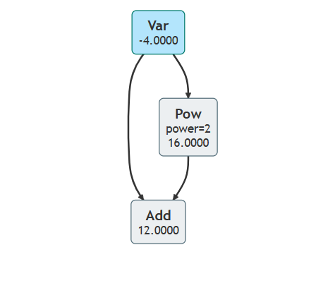
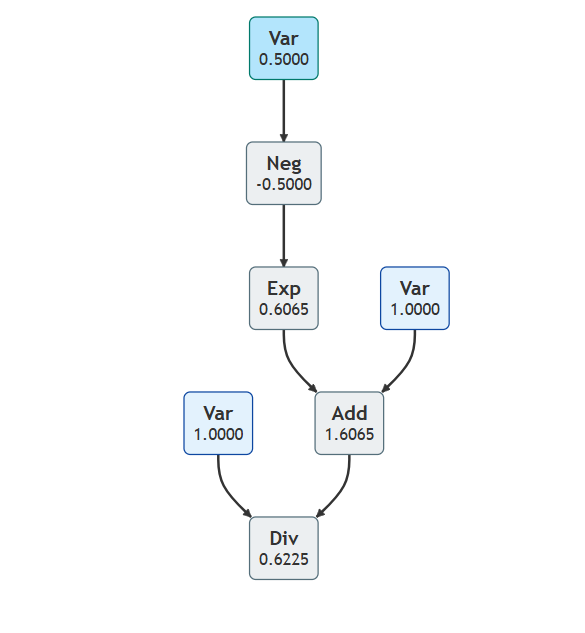
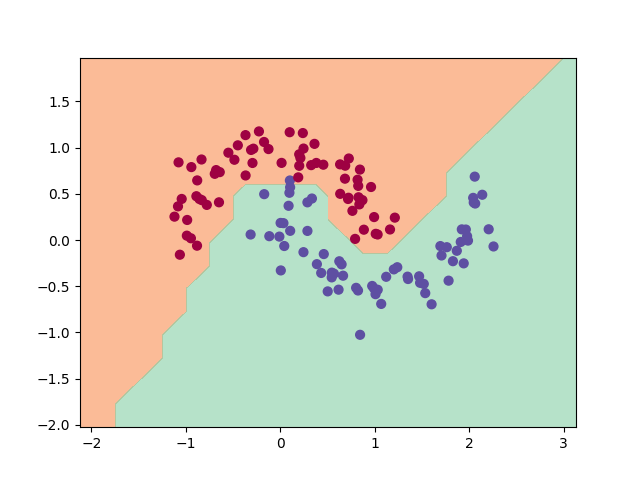

# regrad
[中文](./README_zh.md)

**regrad** is an educational implementation of reverse mode automatic differentiation that is **<u>distinct</u>** from Karpathy's [micrograd ](https://github.com/karpathy/micrograd). It helps users gain a deep understanding of how automatic differentiation works. The `tools` in `regrad` can easily generate computation graphs with different colors for different types of nodes: dark blue for variable nodes that can compute gradients, light blue for variables and constants that cannot compute gradients, and gray for operator nodes. The graphing tool does not rely on external Python libraries.

##### differences between `regrad` and `micrograd` :


• `micrograd` focuses on variables, while `regrad` focuses on operators. `regrad`is more mathematical, whereas `micrograd` is more programming-oriented.

• `micrograd` stores intermediate gradients in the computation graph. However, gradients are only meaningful at the leaf nodes of the graph. Therefore, `regrad`does not store intermediate gradients, which saves memory, especially in tensor computations.

### Example usage

```python
from regrad import Var
from tools import draw_to_html

a = Var(-4.0, req_grad=True)
b = Var(2.0, req_grad=True)
c_5 = Var(5)  # const
c = a + b
d = a * b + b ** 3
c += c + 1
c += 1 + c + (-a)
d += d * 2 + (b + a).relu()
d += c_5 * d + (b - a).relu()
e = c - d
f = e ** 2
g = f / 2.0
g += 10.0 / f
print(f'{g.val:.4f}')   # prints 24.7041, the outcome of this forward pass
g.backward()
print(f'{a.grad:.4f}')  # prints 222.1341, i.e. the numerical value of dg/da
print(f'{b.grad:.4f}')  # prints 978.7784, i.e. the numerical value of dg/db

y = a + a ** 2
draw_to_html(y, "computed_graph_pow")
```

The generated computation graph with an exponential function looks like this:



### Sigmoid Example

```python
from regrad import Var
from tools import draw_to_html

def sigmoid(x: Var) -> Var:
    return 1 / (1 + (-x).exp())

y = sigmoid(Var(0.5, req_grad=True))
draw_to_html(y, "computed_graph_sigmoid")
```

This generates a beautiful computation graph for the `sigmoid` function:



### Debugging a Multi-Layer Perceptron(MLP)

```python
from regrad import Var
from tools.nn import MLP
from tools import draw_to_html

model = MLP(2, [3, 1])  # 3-neurons, 1-layer
print("number of parameters", len(model.parameters()))
x = Var(0.5)
y = model([x, x ** 2])
draw_to_html(y, "computed_graph_mlp", "BT")
```

The generated computation graph looks like this:


### Training a neural net

This example is inspired by micrograd's `demo.ipynb` and is implemented in `basic_3_nn.py` . The code provides a full demo of training an 2-layer neural network (MLP) binary classifier. This is achieved by initializing a neural net from `tools.nn` module, implementing a simple svm "max-margin" binary classification loss and using SGD for optimization. As shown in the notebook, using a 2-layer neural net with two 16-node hidden layers we achieve the following decision boundary on the moon dataset:



### Running tests

To run the unit tests you will have to install [PyTorch](https://pytorch.org/), which the tests use as a reference for verifying the correctness of the calculated gradients. Then simply:

```bash
python -m pytest
```

