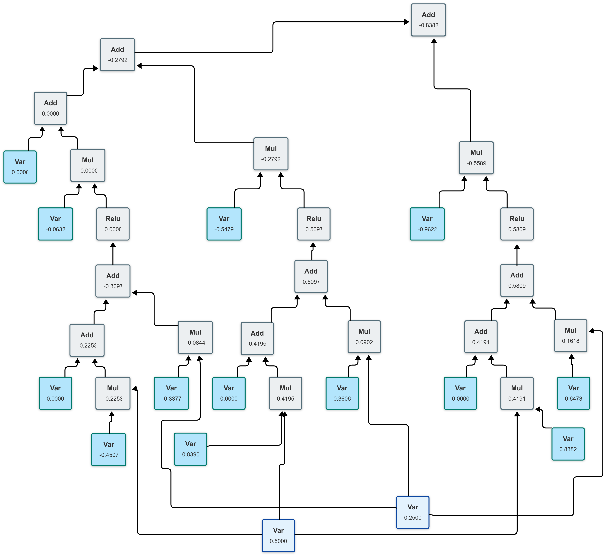

# regrad [](https://github.com/neluca/regrad/actions/workflows/unit_test.yaml) 

**regrad**是一个不同于 [micrograd ](https://github.com/karpathy/micrograd)的小巧反向自动微分实现，可以让人深入了解自动微分的运行机制。`regrad`的`tools`可以非常方便地画出计算图，并用不同的颜色标记不同类型的节点。深蓝色代表可以计算梯度的变量节点，浅蓝色代表不可计算梯度的变量和常量节点，灰色代表算子节点。作图工具不依赖`Python`的外部库。

#### `regrad`与`micrograd`的不同点：

- `mcriograd`以变量视角，而`regrad`则以算子视角。`regrad`更加的数学，`micrograd`更加的程序。
- `micrograd`会保存计算图的中间梯度，而实际上梯度只有在计算图的叶子节点上才会起作用，所以`regrad`不保存计算图的中间梯度，这在后续`tensor`的计算中非常节约内存。

### 使用举例

```python
from regrad import Var
from tools import draw_to_html

a = Var(-4.0, req_grad=True)
b = Var(2.0, req_grad=True)
c_5 = Var(5)  # const
c = a + b
d = a * b + b ** 3
c += c + 1
c += 1 + c + (-a)
d += d * 2 + (b + a).relu()
d += c_5 * d + (b - a).relu()
e = c - d
f = e ** 2
g = f / 2.0
g += 10.0 / f
print(f'{g.val:.4f}')   # prints 24.7041, the outcome of this forward pass
g.backward()
print(f'{a.grad:.4f}')  # prints 222.1341, i.e. the numerical value of dg/da
print(f'{b.grad:.4f}')  # prints 978.7784, i.e. the numerical value of dg/db

y = a + a ** 2
draw_to_html(y, "computed_graph_pow")
```

画出的包含幂函数的计算图如下：


### Sigmoid举例

```python
from regrad import Var
from tools import draw_to_html

def sigmoid(x: Var) -> Var:
    return 1 / (1 + (-x).exp())

y = sigmoid(Var(0.5, req_grad=True))
draw_to_html(y, "computed_graph_sigmoid")
```

可以得到非常漂亮的`sigmoid`计算图


### 调试MLP

```python
from regrad import Var
from tools.nn import MLP
from tools import draw_to_html

model = MLP(2, [3, 1])  # 3-neurons, 1-layer
print("number of parameters", len(model.parameters()))
x = Var(0.5)
y = model([x, x ** 2])
draw_to_html(y, "computed_graph_mlp", "BT")
```

画出计算图如下：



### 训练一个神经网络

这里参考了`micrograd`的`demo.ipynb`实现，代码在`basic_3_nn.py`里面，训练了一个两层神网络二分类器，需要`scikit-learn`提供`moon`数据集。其结果展示如下：


### 单元测试

运行单元测试需要安装[PyTorch](https://pytorch.org/)库，用于验证梯度计算的正确性。

```bash
python -m pytest
```
